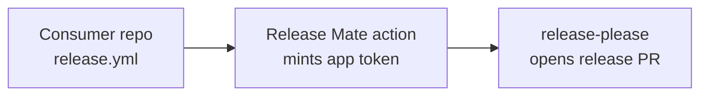

# Release Mate Action

[](https://github.com/release-mate/action/actions/workflows/ci.yml)
[](https://securityscorecards.dev/viewer/?uri=github.com/release-mate/action)
[](LICENSE)

A reusable GitHub Actions workflow and composite action that run
[release-please](https://github.com/googleapis/release-please) with a
short-lived GitHub App installation token instead of a personal access token.

This repository ships the runtime only. The GitHub App that mints the tokens
is documented separately in
[release-mate](https://github.com/release-mate). Register that app
on your organization once, then wire the action below into each consumer
repository.

## Why an app token is used

The default release-please workflow uses `GITHUB_TOKEN`, which cannot trigger
downstream workflows from the release commit. The common workaround — a
fine-grained PAT per repository — is account-bound, rotates per repository,
and leaks blast-radius across every repo it's scoped to. This action mints a
repository-scoped installation token per workflow run that expires in roughly
an hour. See [release-mate](https://github.com/release-mate) for
the full rationale and the app's permission model.

## How it works



1. A push to the default branch triggers `release.yml` in the consumer repo.
2. The action exchanges the app's private key for an installation token
   scoped to that one repository.
3. `googleapis/release-please-action` runs with the minted token.
4. The token expires when the job ends.

## Usage

**Prerequisite:** your organization has registered a Release Mate GitHub App
and installed it on the consumer repository. See
[release-mate](https://github.com/release-mate) for setup. The app
credentials must be available as organization secrets:

- `RELEASE_MATE_CLIENT_ID`
- `RELEASE_MATE_PRIVATE_KEY`

### Reusable workflow

Add `.github/workflows/release.yml` to the consumer repository:

<!-- x-release-please-start-version -->

```yaml
name: Release

on:
  push:
    branches: [main]

jobs:
  release:
    uses: release-mate/action/.github/workflows/release-please.yml@v1.2.0
    secrets:
      client-id: ${{ secrets.RELEASE_MATE_CLIENT_ID }}
      app-private-key: ${{ secrets.RELEASE_MATE_PRIVATE_KEY }}
```

<!-- x-release-please-end -->

If your organization restricts which reusable workflows can be called, vendor
`release-please.yml` into your own tooling repository and reference it from
there instead:

<!-- x-release-please-start-version -->

```yaml
jobs:
  release:
    uses: your-org/release-tooling/.github/workflows/release-please.yml@v1.2.0
    secrets:
      client-id: ${{ secrets.RELEASE_MATE_CLIENT_ID }}
      app-private-key: ${{ secrets.RELEASE_MATE_PRIVATE_KEY }}
```

<!-- x-release-please-end -->

Add the standard release-please configuration files to the repository root:

- `release-please-config.json`
- `.release-please-manifest.json`

### Composite action

If you prefer to keep release-please as one step inside an existing job rather
than a separate reusable-workflow job, use the composite action instead:

<!-- x-release-please-start-version -->

```yaml
name: Release

on:
  push:
    branches: [main]

permissions: {}

jobs:
  release:
    runs-on: ubuntu-latest
    permissions: {}
    steps:
      - uses: release-mate/action@v1.2.0
        with:
          client-id: ${{ secrets.RELEASE_MATE_CLIENT_ID }}
          app-private-key: ${{ secrets.RELEASE_MATE_PRIVATE_KEY }}
```

<!-- x-release-please-end -->

The reusable workflow and the composite action expose the same inputs and
outputs. Pick the reusable workflow when you want a dedicated job with
`permissions: {}` at the workflow level; pick the composite action when you
need to chain release-please with other steps in the same job.

## Swapping in from a release-please PAT setup

1. Confirm your Release Mate app is installed on the repository (see
   [release-mate](https://github.com/release-mate)).
2. Replace the existing release workflow with one of the snippets above.
3. Delete the repository-level PAT secret.
4. Revoke the PAT.

The app token has the same effective permissions as a release-scoped
fine-grained PAT, so existing release-please configuration carries over
unchanged.

## Security model

This action's runtime guarantees:

- The reusable workflow declares `permissions: {}` at the workflow level, so
  the default `GITHUB_TOKEN` is stripped — only the minted app token is in
  scope.
- The installation token is masked in step outputs and discarded when the job
  ends.
- The token is scoped to a single repository per run and expires in roughly
  an hour.

The app's security properties (private key custody, no webhooks, no inbound
surface) are documented in
[release-mate](https://github.com/release-mate).

To report a security issue in this action, see [SECURITY.md](SECURITY.md).

## Troubleshooting

| Symptom | Cause | Fix |
|---------|-------|-----|
| `actions/create-github-app-token` step fails with 404 | App not installed on this repository | Install your Release Mate app on the repository in org settings, then re-run. |
| API calls return 403 after the token mints successfully | Token's `repositories:` scope mismatches the caller repo name, or the app lacks a required permission | Confirm the caller workflow runs in the repository the app is installed on; check the app's permission scopes against [release-mate](https://github.com/release-mate). |
| Release PR opens but never tags a release | Commits since the last release are not Conventional Commits | Run `committed HEAD~..HEAD` locally; release-please ignores commits without recognised types. |
| `permissions: {}` strips a permission you need | The default `GITHUB_TOKEN` is stripped, but you wanted to use it for an extra step | Add the permission to the specific job that needs it; the app token still mints under its own scopes. |

## Limitations

- This action runs inside GitHub Actions. If your release flow runs
  elsewhere, it does not help.
- The reusable workflow must be allowlisted under organization Actions
  settings if your org restricts reusable workflows.

## Contributing

Run `./bin/setup` once after cloning to install the developer toolchain
(lefthook, actionlint, gitleaks, mado, committed) and wire up the git hooks.
Supported on macOS and Linux.

Pre-commit hooks lint the workflow YAML, scan for accidentally committed
secrets, lint Markdown, and tidy whitespace before each commit. The commit-msg
hook enforces [Conventional Commits](https://www.conventionalcommits.org/) so
that release-please can compute version bumps correctly.
