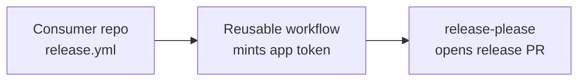

# Release Baton

A GitHub App that runs
[release-please](https://github.com/googleapis/release-please) on your
repositories without the personal access token sprawl.

Install the app, add a five-line workflow to each repository, and Release Baton
mints a short-lived, repository-scoped installation token at release time. No
shared PATs, no rotation toil, no account-bound credentials.

## Why

The default release-please workflow uses `GITHUB_TOKEN`, which cannot trigger
downstream workflows from the release commit. Teams work around this by minting
fine-grained personal access tokens — one per repository — and storing them as
secrets. That pattern is painful:

- PATs are bound to a human account; they break when that account leaves the org.
- Fine-grained PATs expire and need rotating per repository.
- A leaked PAT exposes every repository it was scoped to.
- New repositories need new tokens before they can release.

Release Baton replaces every release PAT in your organization with one GitHub
App. Tokens are minted per workflow run, scoped to a single repository, and
expire in roughly an hour.

## How it works

Release Baton is a credential broker, not a service. There is no backend to
host. The app is registered once, installed on the repositories that should
release, and consumed by a reusable workflow that lives in a central tooling
repository.



1. A push to the default branch in a consumer repository triggers `release.yml`.
2. The caller workflow invokes the org's reusable workflow.
3. The reusable workflow exchanges the app's private key for an installation
   token scoped to that one repository.
4. `googleapis/release-please-action` runs with the minted token and opens or
   merges the release pull request.
5. The token expires when the job ends.

## Permissions

Release Baton requests only what release-please needs:

| Scope | Access | Why |
|-------|--------|-----|
| Contents | Read & write | Branches, commits, tags, releases |
| Pull requests | Read & write | Open and update release pull requests |
| Issues | Read & write | Apply labels to release pull requests |
| Workflows | Read & write | Optional — only required if release commits modify `.github/workflows/**` |

The app subscribes to no events and exposes no webhooks.

## Installation

### One-time setup (org admin)

1. Register the GitHub App on your organization. Set the homepage to your
   tooling repository, leave the callback URL blank, disable webhooks, and
   grant the permissions listed above.
2. Generate a private key and download the `.pem` file.
3. Note the App ID.
4. Install the app on the repositories that should release.
5. Store the credentials as **organization secrets**:
   - `RELEASE_BATON_APP_ID`
   - `RELEASE_BATON_PRIVATE_KEY`

### Per-repository setup

Add `.github/workflows/release.yml` to the consumer repository:

```yaml
name: Release

on:
  push:
    branches: [main]

jobs:
  release:
    uses: your-org/release-tooling/.github/workflows/release-please.yml@v1
    secrets:
      app-id: ${{ secrets.RELEASE_BATON_APP_ID }}
      app-private-key: ${{ secrets.RELEASE_BATON_PRIVATE_KEY }}
```

Add the standard release-please configuration files to the repository root:

- `release-please-config.json`
- `.release-please-manifest.json`

That's the entire per-repository footprint.

## Migrating from a personal access token

1. Install Release Baton on the repository.
2. Replace the existing release workflow with the caller workflow above.
3. Delete the repository-level PAT secret.
4. Revoke the PAT.

The app token has the same effective permissions as a release-scoped
fine-grained PAT, so existing release-please configuration carries over
unchanged.

## Security model

- The private key lives in one place (organization secrets), not scattered
  across repositories.
- Installation tokens are short-lived (~1 hour) and scoped to a single
  repository per run.
- The reusable workflow declares `permissions: {}` at the workflow level, so
  the default `GITHUB_TOKEN` is stripped — only the minted app token is in
  scope.
- The app subscribes to no events; there is no inbound attack surface beyond
  the GitHub API itself.
- Rotating the private key is one operation in organization settings; consumer
  repositories require no changes.

## Limitations

- Release Baton runs inside GitHub Actions. If your release flow runs
  elsewhere, this app does not help.
- The app installation must include every repository that needs to release.
  Repositories outside the installation will receive 403 from the API even if a
  token is minted.
- The reusable workflow must be allowlisted under organization Actions settings
  if your org restricts reusable workflows.

## Contributing

Run `./bin/setup` once after cloning to install the developer toolchain
(lefthook, actionlint, gitleaks, mado, committed) and wire up the git hooks.
Supported on macOS and Linux.

Pre-commit hooks lint the workflow YAML, scan for accidentally committed
secrets, lint Markdown, and tidy whitespace before each commit. The commit-msg
hook enforces [Conventional Commits](https://www.conventionalcommits.org/) so
that release-please can compute version bumps correctly.

## Naming

A baton is what a conductor passes between sections of an orchestra — a small,
deliberate handoff that keeps everything in time. Release Baton hands
credentials from your organization to the workflow that needs them, briefly,
then takes them back.
